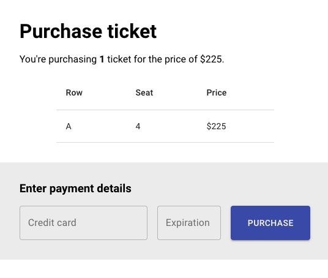

# Exercise 8B: Populating the modal

The modal should show a little table with the seat information, as well as a form for the user to enter their credit cards. Browse the Material UI components to find some helpful pieces. Visit [mui](https://mui.com/), and click on "Getting Started". Then, expand "Components" in the bar on the left to see a categorized list of available components.

(hint: you probably want a couple things from the "Inputs" section!)

Your goal should be to create a UI that looks something like this, pulling all relevant data from the `BookingContext` state:



You can also create two new pieces of React state: `creditCard` and `expiration`. Use the `useState` hook for both of these pieces of state:

```js
const [creditCard, setCreditCard] = useState("");
const [expiration, setExpiration] = useState("");
```

You should update this state when the user types in the text inputs, so that the React state is always in sync with what's shown on the page form.
